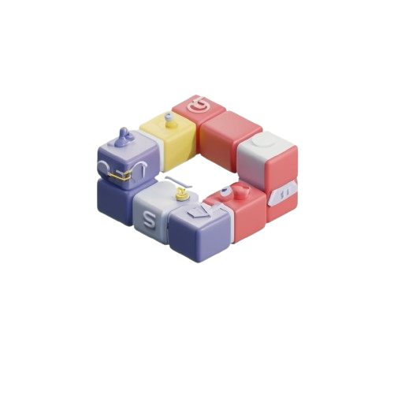

# C++ Blockchain Project

This project is a simple implementation of a blockchain in C++, with a backend server that handles the blockchain operations and interacts with a basic front end that visualizes the blockchain simulation.

## Features

- **Blockchain:** The project implements a basic blockchain structure with blocks, each containing an index, timestamp, data, previous hash, and its own hash.

- **Backend Server:** The backend server manages the blockchain and handles interactions with the front end (completely written in CPP).

- **Frontend Interface:** The project includes a basic web interface (HTML/CSS/JS) for interacting with the blockchain through HTTP requests.
